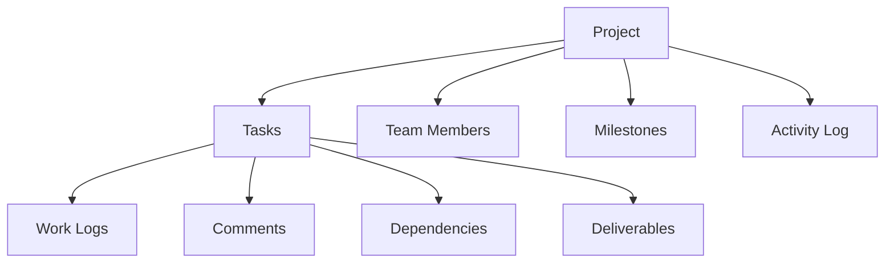

# Forge Protocol

A blockchain-powered decentralized project management infrastructure enabling transparent, accountable, and collaborative team workflows.

## Overview

Forge Protocol is an innovative project management platform built on the Stacks blockchain that provides immutable, transparent tracking of project lifecycles, tasks, and team interactions. The system offers comprehensive tools for modern, distributed teams:

- Decentralized project tracking
- Cryptographically secure task management
- Dynamic role-based access control
- Transparent milestone progression
- Verifiable work logging
- Immutable collaboration records
- On-chain activity auditing

## Architecture

The protocol is built around a core smart contract managing all project-related data and operations. Here's the interconnected system design:



## Contract Documentation

### Core Contract (forge-core.clar)

The primary contract managing the entire project management protocol.

#### Key Features:
- Decentralized project lifecycle management
- Cryptographically tracked task dependencies
- Role-stratified team member permissions
- Milestone completion verification
- Granular work logging mechanisms
- Comprehensive activity audit trails

#### Role Hierarchy:
1. Owner (highest permissions)
2. Manager
3. Contributor
4. Viewer (lowest permissions)

## Getting Started

### Prerequisites
- Clarinet
- Stacks wallet
- Node.js environment

### Installation

1. Clone the repository
2. Install dependencies
```bash
clarinet install
```
3. Run tests
```bash
clarinet test
```

## Function Reference

### Project Management

```clarity
(create-project (title (string-utf8 100)) 
                (description (string-utf8 500))
                (start-date uint)
                (end-date uint)
                (budget uint))
```

```clarity
(update-project (project-id uint)
                (title (string-utf8 100))
                (description (string-utf8 500))
                (status uint)
                (start-date uint)
                (end-date uint)
                (budget uint))
```

### Task Management

```clarity
(create-task (project-id uint)
             (title (string-utf8 100))
             (description (string-utf8 500))
             (assignee (optional principal))
             (priority uint)
             (estimated-hours uint)
             (start-date uint)
             (due-date uint)
             (milestone-id (optional uint)))
```

```clarity
(update-task-status (project-id uint)
                    (task-id uint)
                    (new-status uint))
```

### Team Management

```clarity
(add-team-member (project-id uint)
                 (member principal)
                 (role uint))
```

```clarity
(update-team-member-role (project-id uint)
                        (member principal)
                        (new-role uint))
```

## Development

### Testing

Run the test suite:
```bash
clarinet test
```

### Local Development

1. Start local chain:
```bash
clarinet integrate
```

2. Deploy contracts:
```bash
clarinet deploy
```

## Security Considerations

1. Role-based access control
   - All sensitive operations require appropriate permissions
   - Owner role cannot be transferred or removed

2. Data Validation
   - All inputs are validated before processing
   - Status transitions are properly controlled

3. Dependency Management
   - Circular dependencies are prevented
   - Task dependencies must be completed before dependent tasks can start

4. State Management
   - Critical state changes are atomic
   - Activity logging provides audit trail

5. Known Limitations
   - No bulk operations supported
   - Cannot delete projects or tasks (only cancel)
   - File storage must be handled off-chain